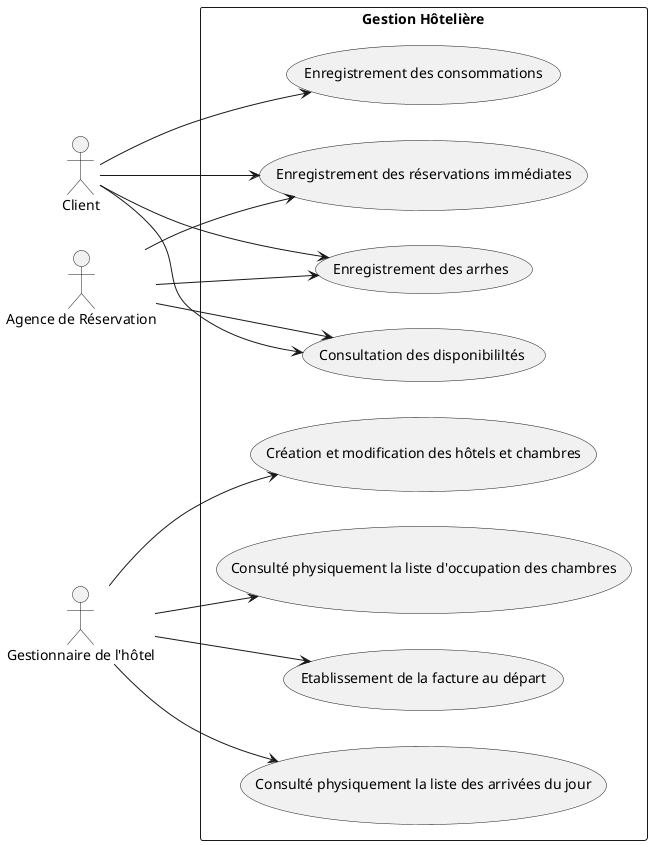
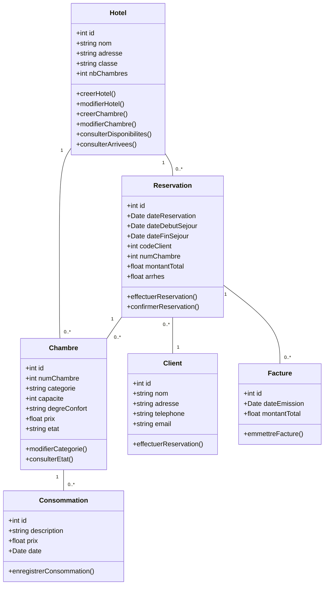
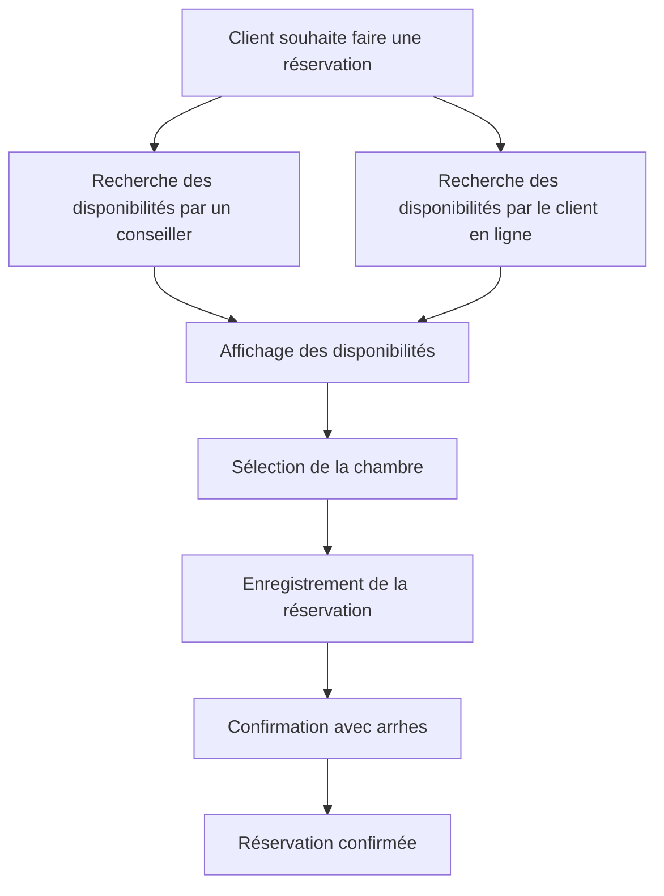
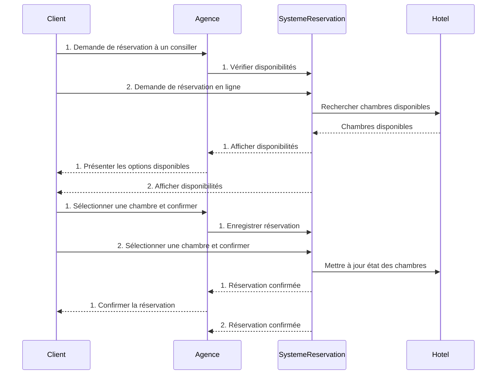

# Exo_UML_Merise

## EXO Merise

Pour plus de détails, veuillez consulter le [document de devoir](Devoir%20persistence.docx).

## EXO UML 

### 1. Représenter le diagramme des cas d’utilisation de ce système

.

### 2. Réalisez le diagramme de classes pour modéliser les éléments ci-dessus, en définissant les attributs et les méthodes (opérations) de chaque classe de ce diagramme, ainsi que les cardinalités des associations entre les classes.

### 3. Réalisez le diagramme d’activité du processus de réservation

### 4. Réalisez le diagramme de séquence du processus de réservation

