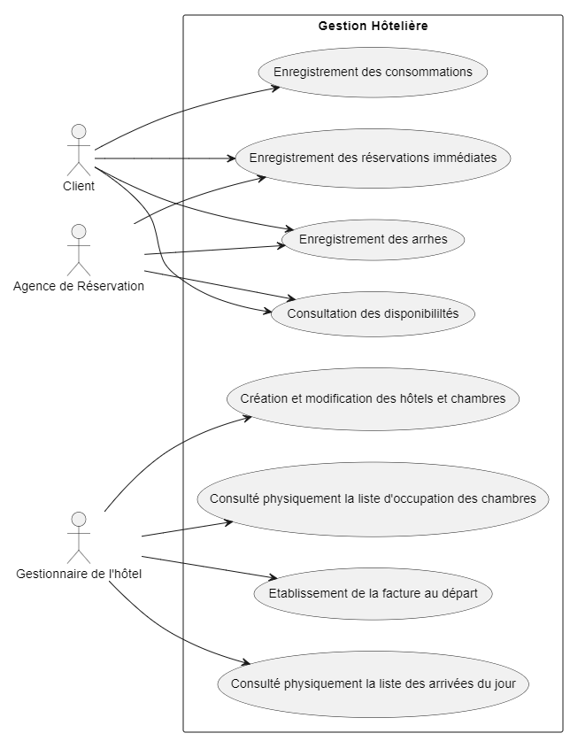

# Exo_UML_Merise

## EXO Merise

### 1. lister les données nécessaires

Dépêches AFP (DepêcheAFP)
- id : Identifiant unique de la dépêche (Integer)
- titre : Titre de la dépêche (String)
- contenu : Contenu de la dépêche (Text)
- date : Date de publication de la dépêche (Date)
- source : Source de la dépêche, par défaut "AFP" (String)
- categorie : Catégorie de la dépêche (politique, économie, sport, etc.) (String)


Articles Générés (ArticleGenere)
- id : Identifiant unique de l'article généré (Integer)
- titre : Titre de l'article généré (String)
- contenu : Contenu généré de l'article (Text)
- date : Date de génération de l'article (Date)
- categorie : Catégorie de l'article (String)
- tags : Tags associés à l'article (String)
- images : Liste des images associées à l'article (ListImages)
- videos : Liste des videos associées à l'article (ListVideos)

Sorties IA (SortieIA)
Classe abstraite représentant les différentes sorties générées par IA (texte, image, vidéo).
- id : Identifiant unique de la sortie IA (Integer)
- type : Type de sortie (texte, image, vidéo) (String)
- contenu : Contenu de la sortie IA (String)
- article : Référence à l'article généré auquel la sortie est associée (ArticleGenere)

Texte (Texte)
Sous-classe de SortieIA représentant un texte généré par IA.
- texte : Contenu textuel généré (String)

Image (Image)
Sous-classe de SortieIA représentant une image générée par IA.
- url : URL de l'image (String)
- description : Description de l'image (String)

Publicités (Publicite)
- id : Identifiant unique de la publicité (Integer)
- contenu : Contenu de la publicité (Text)
- url : URL de la publicité (String)
- article : Référence à l'article généré auquel la publicité est associée (ArticleGenere)

### 2. créer le diagramme de classe UML


### 3. créer le diagramme MCD Merise


### 4. créer le schéma relationnel des tables grâce à un ORM dans le langage de votre choix

```
from sqlalchemy import create_engine, Column, Integer, String, Text, Date, ForeignKey
from sqlalchemy.ext.declarative import declarative_base
from sqlalchemy.orm import relationship, sessionmaker

Base = declarative_base()

class DepecheAFP(Base):
    __tablename__ = 'depeches_afp'
    id = Column(Integer, primary_key=True)
    titre = Column(String, nullable=False)
    contenu = Column(Text, nullable=False)
    date = Column(Date, nullable=False)
    source = Column(String, default="AFP")
    categorie = Column(String, nullable=False)
    articles = relationship("ArticleGenere", back_populates="depeche")

class ArticleGenere(Base):
    __tablename__ = 'articles_genere'
    id = Column(Integer, primary_key=True)
    titre = Column(String, nullable=False)
    contenu = Column(Text, nullable=False)
    date = Column(Date, nullable=False)
    categorie = Column(String, nullable=False)
    tags = Column(String)
    depeche_id = Column(Integer, ForeignKey('depeches_afp.id'))
    depeche = relationship("DepecheAFP", back_populates="articles")
    publicites = relationship("Publicite", back_populates="article")
    sortiesIA = relationship("SortieIA", back_populates="article")

class SortieIA(Base):
    __tablename__ = 'sorties_ia'
    id = Column(Integer, primary_key=True)
    type = Column(String, nullable=False)
    contenu = Column(Text, nullable=False)
    article_id = Column(Integer, ForeignKey('articles_genere.id'))
    article = relationship("ArticleGenere", back_populates="sortiesIA")

class Texte(SortieIA):
    __tablename__ = 'textes'
    id = Column(Integer, ForeignKey('sorties_ia.id'), primary_key=True)
    texte = Column(Text, nullable=False)

class Image(SortieIA):
    __tablename__ = 'images'
    id = Column(Integer, ForeignKey('sorties_ia.id'), primary_key=True)
    url = Column(String, nullable=False)
    description = Column(Text)

class Video(SortieIA):
    __tablename__ = 'videos'
    id = Column(Integer, ForeignKey('sorties_ia.id'), primary_key=True)
    url = Column(String, nullable=False)
    description = Column(Text)

class Publicite(Base):
    __tablename__ = 'publicites'
    id = Column(Integer, primary_key=True)
    contenu = Column(Text, nullable=False)
    url = Column(String)
    article_id = Column(Integer, ForeignKey('articles_genere.id'))
    article = relationship("ArticleGenere", back_populates="publicites")
```

## EXO UML HOTEL

### 1. Représenter le diagramme des cas d’utilisation de ce système


.

### 2. Réalisez le diagramme de classes pour modéliser les éléments ci-dessus, en définissant les attributs et les méthodes (opérations) de chaque classe de ce diagramme, ainsi que les cardinalités des associations entre les classes.


### 3. Réalisez le diagramme d’activité du processus de réservation


### 4. Réalisez le diagramme de séquence du processus de réservation

